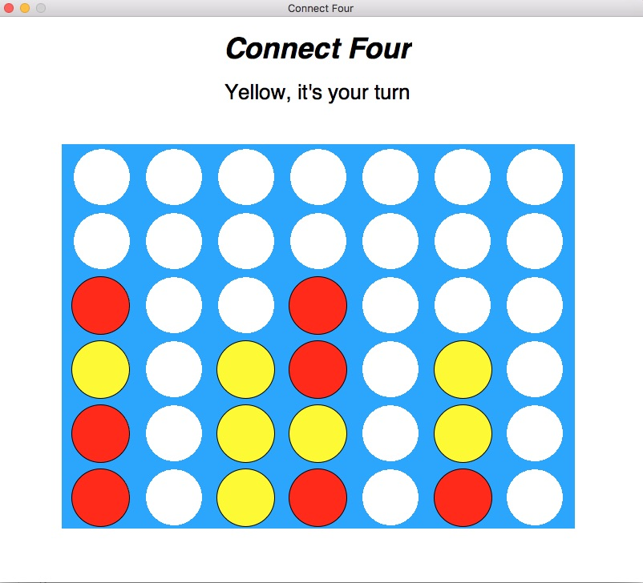

# ConnectFour
## Thomas Scruggs

A program to play the classic game Connect Four. Play against both another human and a computer are supported. The game has three customizable settings: selecting turn order, move animation, and multiple AI difficulty levels.

### How to run the program:
From terimanal, run the program from the command line: "python3 connect4.py"

You will be prompted to choose the game's settings. Simply select your desired settings and then click on any white circle in the bottom row of the game board to make your first move.

